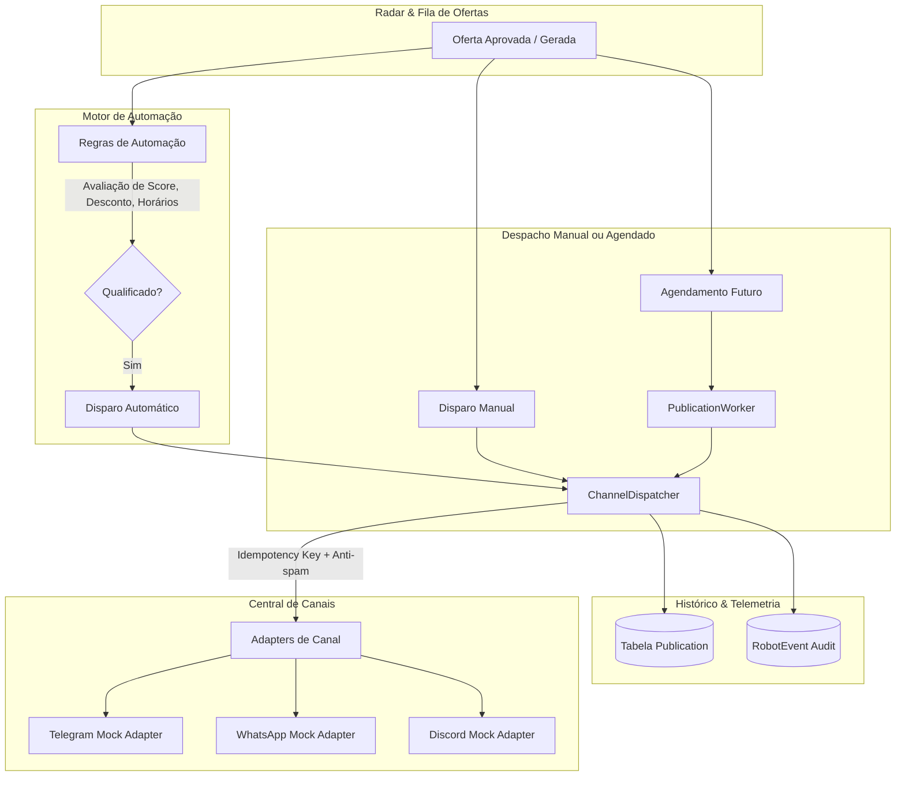

# Phase 4 — Central de Canais, Dispatcher, Automação, Agendamento e Histórico

Este documento detalha a arquitetura, regras de negócio, contratos e fluxos implementados na **Fase 4** da plataforma **Affiliate AI**.

---

## 1. Visão Geral da Fase 4

A Fase 4 transforma a plataforma em uma máquina completa de distribuição e automação de ofertas de afiliados, conectando canais de mensageria (Telegram, WhatsApp, Discord), fornecendo um motor de despacho inteligente com idempotência e proteção contra duplicação, um worker de agendamento em segundo plano e um motor de automação baseado em regras e janelas operacionais.



---

## 2. Modelagem de Dados

### 2.1 Enriquecimento da Entidade `Channel`
- **`provider`**: `TELEGRAM`, `WHATSAPP`, `DISCORD`.
- **`destination`**: Identificador do grupo/canal/webhook (ex: `@promos_vip`, `5511999999999-123456@g.us`).
- **`active`**: Flag booleana indicando se o canal está habilitado para envios.
- **`config`**: JSON criptografado/estruturado contendo credenciais (tokens, api keys, webhooks).
- **`lastTestedAt` / `testResult`**: Registro do último teste de conectividade realizado pelo usuário.

### 2.2 Entidade `Publication` (Histórico de Envios)
- **`id`**: Identificador primário (`pub_xxx`).
- **`userId`**, **`offerId`**, **`channelId`**: Relacionamentos com o usuário, oferta e canal.
- **`status`**: `QUEUED`, `SCHEDULED`, `PROCESSING`, `SENT`, `FAILED`, `CANCELLED`, `RETRYING`.
- **`scheduledAt`**: Data/hora agendada para envio (opcional).
- **`sentAt`**: Data/hora efetiva do envio.
- **`idempotencyKey`**: Chave única derivada de `user:offer:channel:attempt` para garantir envio único e proteção contra concorrência (`@unique([idempotencyKey])`).
- **`providerMessageId`**: ID retornado pelo canal (ex: `tg_msg_...`, `wa_msg_...`, `dc_msg_...`).
- **`payload`**: JSON congelado com o conteúdo da mensagem e metadados disparados.
- **`retryCount`**: Contador de tentativas (máximo 3).
- **`errorMessage` / `errorCode`**: Detalhes de falhas em caso de erro.

### 2.3 Entidade `AutomationRule` (Regras de Piloto Automático)
- **`userId`**: Isolamento multi-tenant.
- **`name`**: Nome amigável da regra.
- **`active`**: Status ligado/desligado.
- **Filtros de Qualificação**:
  - `minOpportunityScore`: Score mínimo (0 a 100).
  - `minCommission`: % mínima de comissão.
  - `minDiscount`: % mínimo de desconto.
  - `platforms`: Lista em JSON das plataformas permitidas (`SHOPEE`, `MERCADOLIVRE`, `AMAZON`).
  - `categories`: Lista em JSON de categorias aceitas.
- **Canais de Destino**:
  - `channelIds`: Lista em JSON dos canais onde a oferta será publicada.
- **Políticas de Anti-Spam e Janela Operacional**:
  - `maxOffersPerDay`: Limite diário de publicações automáticas.
  - `minIntervalMinutes`: Intervalo mínimo entre postagens sucessivas.
  - `allowedStartTime` / `allowedEndTime`: Horário de início e fim da janela de operação (ex: `08:00` às `22:00`).
  - `duplicateCooldownHours`: Tempo de resfriamento para não republicar o mesmo produto (ex: 24 horas).
  - `offerStyle`: Tom de copy preferencial (`DIRECT`, `PROMOTIONAL`, `URGENT`, `BENEFITS`).

---

## 3. Arquitetura de Canais e Adapters (Mock)

Todos os adaptadores implementam o contrato `IChannelAdapter`:

```typescript
export interface IChannelAdapter {
  provider: ChannelProvider;
  testConnection(config: Record<string, unknown>): Promise<ConnectionTestResult>;
  sendOffer(payload: ChannelMessagePayload, config: Record<string, unknown>): Promise<DispatchResult>;
}
```

### 3.1 Identificação Explícita de Mock
Todos os retornos de teste e envio incluem explicitamente a propriedade `source: "mock"` e simulações realistas de latência e IDs determinísticos:

| Provedor | Validação de Configuração | Simulação de Envio | Identificador Gerado |
|---|---|---|---|
| **Telegram** | Exige `botToken` e `chatId`/`destination` | Formatação Telegram MarkdownV2 | `tg_msg_<timestamp>_<random>` |
| **WhatsApp** | Exige `instanceId` ou `apiKey` e `destination` | Formatação WhatsApp (*negrito*, _itálico_) | `wa_msg_<timestamp>_<random>` |
| **Discord** | Exige `webhookUrl` (URL discord.com) | Formatação Embed Markdown | `dc_msg_<timestamp>_<random>` |

---

## 4. Segurança e Proteção de Segredos

A classe `SecretStorage` (`src/lib/security/secret-storage.ts`) garante que:
1. **Nenhum segredo bruto** é retornado para a camada de visualização (front-end).
2. Chaves como `botToken`, `apiKey`, `webhookUrl`, `secret` são mascaradas como:
   `Configurado (••••••••1234)`.
3. Ao editar um canal sem reescrever o segredo, o backend preserva o segredo criptografado/armazenado anterior via `SecretStorage.mergeConfig`.

---

## 5. Motor de Despacho (`ChannelDispatcher`) e Worker

### 5.1 Garantias de Idempotência e Anti-Duplicação
1. **Chave de Idempotência**: Cada envio gera uma chave única `idemp_<userId>_<offerId>_<channelId>_<dateWindow>`.
2. **Janela de 24h**: Antes de disparar, o dispatcher verifica se a mesma oferta já foi enviada com sucesso para o mesmo canal nas últimas 24 horas, bloqueando envios acidentais redundantes.
3. **Política de Retry**: Falhas transitórias são reprocessadas até 3 vezes com status `RETRYING`. Ao atingir o limite, a publicação passa para `FAILED`.

### 5.2 Worker de Publicações em Segundo Plano
O `PublicationWorker` processa em lote:
- Publicações agendadas cujo `scheduledAt <= new Date()`.
- Publicações em estado `QUEUED` e `RETRYING`.
- Atualiza status atômico e registra logs de auditoria em `RobotEvent`.

---

## 6. Motor de Automação (`AutomationEngine`)

O motor de automação avalia ofertas recém-aprovadas em tempo de execução:
1. **Verificação de Ativação**: A regra precisa estar com `active: true`.
2. **Janela de Horário**: Compara a hora atual local com `allowedStartTime` e `allowedEndTime`.
3. **Limite Diário**: Checa quantas ofertas já foram enviadas pela regra no dia atual em relação a `maxOffersPerDay`.
4. **Intervalo Mínimo**: Garante que o tempo desde a última publicação automática seja $\ge$ `minIntervalMinutes`.
5. **Critérios de Qualidade**: Compara Score $\ge$ `minOpportunityScore`, Desconto $\ge$ `minDiscount` e Comissão $\ge$ `minCommission`.
6. **Disparo Automático**: Envia automaticamente para todos os canais associados à regra respeitando todas as travas anti-spam.

---

## 7. Rotas de API Implementadas

| Rota | Método | Descrição |
|---|---|---|
| `/api/channels` | `GET`, `POST` | Lista canais do usuário e cadastra novo canal |
| `/api/channels/[id]` | `GET`, `PUT`, `DELETE` | Consulta, atualiza e remove canal |
| `/api/channels/[id]/test` | `POST` | Executa teste de conectividade no adapter |
| `/api/channels/[id]/activate` | `POST` | Ativa o canal para receber disparos |
| `/api/channels/[id]/deactivate` | `POST` | Desativa o canal temporariamente |
| `/api/publications` | `GET` | Histórico paginado com filtros de status e canal |
| `/api/publications/send` | `POST` | Disparo imediato de uma oferta para canais selecionados |
| `/api/publications/schedule` | `POST` | Agendamento de uma oferta com data/hora futura |
| `/api/publications/[id]/retry` | `POST` | Reprocessa publicação falha |
| `/api/publications/[id]/cancel` | `POST` | Cancela publicação agendada ou pendente |
| `/api/automation/rules` | `GET`, `POST` | Lista e cria regras de automação |
| `/api/automation/rules/[id]` | `GET`, `PUT`, `DELETE` | Consulta, atualiza e remove regras |
| `/api/automation/rules/[id]/activate` | `POST` | Ativa regra de automação |
| `/api/automation/rules/[id]/deactivate` | `POST` | Desativa regra de automação |
| `/api/worker/process-publications` | `POST` | Executa ciclo de processamento do worker |
