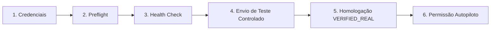

# Fase 7.2: Ativação Real Controlada e Homologação de Produção

## Visão Geral

A Fase 7.2 estabelece o framework definitivo de **ativação controlada, isolamento operacional e blindagem de segurança** para canais e marketplaces no SaaS **Affiliate AI**.

Nenhum canal ou marketplace dispara mensagens reais ou executa mutações externas de forma implícita, automática ou descontrolada. O sistema opera sob um modelo estrito de **Default-Deny (Zero Trust)** com chaves de segurança multinível (Kill Switches).

---

## Pilares de Segurança e Arquitetura

### 1. Kill Switches Globais e Individuais

O subsistema `DispatchGuardService` gerencia o estado operacional através das variáveis de ambiente e switches em tempo de execução:

| Switch | Variável de Ambiente | Padrão | Descrição |
| :--- | :--- | :--- | :--- |
| **Kill Switch Global** | `REAL_DISPATCH_ENABLED` | `false` | Bloqueia 100% de envios reais em todo o sistema se `false`. |
| **Kill Switch Telegram** | `TELEGRAM_ENABLED` | `false` | Controla envio real para canais e grupos do Telegram. |
| **Kill Switch WhatsApp** | `WHATSAPP_ENABLED` | `false` | Controla envio real via Cloud API do WhatsApp. |
| **Kill Switch Discord** | `DISCORD_ENABLED` | `false` | Controla envio real via Webhooks do Discord. |
| **Kill Switch Shopee** | `SHOPEE_ENABLED` | `false` | Controla sincronização e conversão de links Shopee. |
| **Kill Switch Mercado Livre** | `MERCADOLIVRE_ENABLED` | `false` | Controla integração oficial do Mercado Livre. |
| **Kill Switch Amazon** | `AMAZON_ENABLED` | `false` | Controla chamadas à API de criadores da Amazon. |

### 2. Botão de Parada de Emergência ("PARAR")

O sistema conta com um endpoint seguro (`POST /api/integrations/emergency-stop`) e um botão de ação imediata na interface que:
1. Desativa instantaneamente o Kill Switch Global (`REAL_DISPATCH_ENABLED = false`).
2. Desativa todos os Kill Switches de provedores individuais.
3. Transiciona imediatamente todas as publicações com status `SCHEDULED` e `PROCESSING` de origem `real` para status `FAILED` com código `EMERGENCY_STOP`.
4. Emite alerta no log de auditoria imutável (`IntegrationAuditLog`) e notificação de alta prioridade na interface do usuário.

---

## Pipeline de Ativação em 6 Etapas

Nenhum canal pode ser ativado para produção com um único clique. Cada conexão deve passar sequencialmente pelo pipeline estruturado de 6 etapas:

1. **Configuração de Credenciais (`CONFIGURE`)**:
   - Validação de formato (regex para tokens, URLs, AppIDs).
   - Criptografia simétrica com chave mestra via `AES-256-GCM`.
   - Máscara permanente na interface (`••••••••1234`).
2. **Diagnóstico Estrutural (`PREFLIGHT`)**:
   - Verificação de permissões do escopo.
   - Detecção de rate limits e conectividade básica.
3. **Health Check Não-Destrutivo (`HEALTH_CHECK`)**:
   - Chamada leve e segura à API oficial (ex: `getMe` do Telegram, `GET /v20.0/{phone_id}` do WhatsApp).
   - Sem publicação de conteúdo ou consumo de cota destrutiva.
4. **Envio de Teste Controlado (`TEST_SEND`)**:
   - Requer confirmação explícita (`confirmed: true`).
   - Envia mensagem padronizada de validação: `[TESTE DE CONEXÃO - AFFILIATE AI]`.
   - Permite verificar o canal sem impactar a audiência com ofertas comerciais reais.
5. **Homologação (`PROMOTE_TO_VERIFIED_REAL`)**:
   - Bloqueada se as etapas 1, 2 ou 3 estiverem pendentes.
   - Promove o status da conexão para `VERIFIED_REAL`.
6. **Controle Granular do Autopiloto (`TOGGLE_AUTOPILOT`)**:
   - Interruptor independente para conceder ou revogar permissão de postagem autônoma.
   - Se revogado, o canal permanece homologado para disparos manuais, mas bloqueado para o Autopiloto.

---

## Isolamento Rigoroso MOCK vs REAL

- **Canais Mock**: Utilizam provedor `mock`, operam localmente com latência simulada e taxas determinísticas de sucesso (100% livres de dependência externa).
- **Canais Reais**: Utilizam provedores `telegram-api`, `whatsapp-cloud`, `discord-webhook`, etc.
- **Safety Gate**: Rejeita qualquer oferta direcionada a um canal real se:
  1. `REAL_DISPATCH_ENABLED` for `false`.
  2. O canal não possuir `isVerifiedReal = true`.
  3. A conexão não tiver permissão expressa para o Autopiloto.
